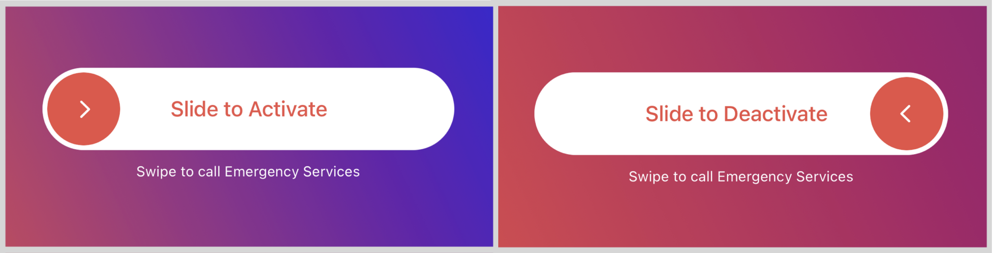

# Unlock Slider
Fully customized Slide to Unlock Control, written on Swift under the short name - UnlockSlider.




[](https://github.com/stolyarenkoks/UnlockSlider/issues)
[](https://github.com/stolyarenkoks/UnlockSlider/network)
[](https://github.com/stolyarenkoks/UnlockSlider/stargazers)


[](https://github.com/stolyarenkoks/UnlockSlider/blob/develop/LICENSE)

- [Features](#features)
- [Requirements](#requirements)
- [Communication](#communication)
- [Installation](#installation)
- [Usage](#usage)
- [License](#license)

## Features

- [x] Full customization of colors, fonts and images
- [x] Ability to change sizes and margins
- [x] Ability to change animation speed, turn on/off additional effects
- [x] Delegate methods
- [x] Slider operation both in two directions and in one

## Requirements

- iOS 14.0+
- Xcode 14.0+
- Swift 5.0+

## Communication
- If you'd like to **contact us** write to stolyarenko.kons@gmail.com
- If you **found a bug**, open an issue here on GitHub and follow the guide. The more detail the better!
- If you **want to contribute**, submit a pull request.

## Installation

### CocoaPods

[CocoaPods](https://cocoapods.org) is a dependency manager for Cocoa projects. For usage and installation instructions, visit their website. To integrate Alamofire into your Xcode project using CocoaPods, specify it in your `Podfile`:

```ruby
pod 'UnlockSlider', '~> 0.1.0'
```

### Carthage

[Carthage](https://github.com/Carthage/Carthage) is a decentralized dependency manager that builds your dependencies and provides you with binary frameworks. To integrate Alamofire into your Xcode project using Carthage, specify it in your `Cartfile`:

```ogdl
github "stolyarenkoks/UnlockSlider" "0.1.0"
```

### Swift Package Manager

The [Swift Package Manager](https://swift.org/package-manager/) is a tool for automating the distribution of Swift code and is integrated into the `swift` compiler. It is in early development, but UnlockSlider does support its use on supported platforms.

Once you have your Swift package set up, adding UnlockSlider as a dependency is as easy as adding it to the `dependencies` value of your `Package.swift`.

```swift
dependencies: [
    .package(url: "https://github.com/stolyarenkoks/UnlockSlider", from: "0.1.0")
]
```

### Manually

If you prefer not to use any of the aforementioned dependency managers, you can integrate UnlockSlider into your project manually.

#### Embedded Framework

- Open up Terminal, `cd` into your top-level project directory, and run the following command "if" your project is not initialized as a git repository:

  ```bash
  $ git init
  ```

- Add UnlockSlider as a git [submodule](https://git-scm.com/docs/git-submodule) by running the following command:

  ```bash
  $ git submodule add https://github.com/stolyarenkoks/UnlockSlider
  ```

- Open the new `UnlockSlider` folder, and drag the `UnlockSlider.xcodeproj` into the Project Navigator of your application's Xcode project.

    > It should appear nested underneath your application's blue project icon. Whether it is above or below all the other Xcode groups does not matter.

- Select the `UnlockSlider.xcodeproj` in the Project Navigator and verify the deployment target matches that of your application target.
- Next, select your application project in the Project Navigator (blue project icon) to navigate to the target configuration window and select the application target under the "Targets" heading in the sidebar.
- In the tab bar at the top of that window, open the "General" panel.
- Click on the `+` button under the "Embedded Binaries" section.
- You will see two different `UnlockSlider.xcodeproj` folders each with two different versions of the `UnlockSlider.framework` nested inside a `Products` folder.

    > It does not matter which `Products` folder you choose from, but it does matter whether you choose the top or bottom `UnlockSlider.framework`.

- Select the top `UnlockSlider.framework` for iOS and the bottom one for macOS.

- And that's it!

  > The `UnlockSlider.framework` is automagically added as a target dependency, linked framework and embedded framework in a copy files build phase which is all you need to build on the simulator and a device.
  
## Usage

### UnlockSlider

```swift
import UnlockSlider
```

The slider can be inserted in a view hierarchy as a subview. <br>
Appearance can be configured with a number of public attributes and methods:

```swift
let slider = UnlockSlider(frame: sliderContainer.frame, delegate: self)

slider.isDoubleSideEnabled = true
slider.isImageViewRotating = true
slider.isTextChangeAnimating = true
slider.isDebugPrintEnabled = false
slider.isShowSliderText = true
slider.isEnabled = true

slider.sliderAnimationVelocity = 0.2
slider.sliderViewTopDistance = .zero
slider.sliderImageViewTopDistance = 4.0
slider.sliderImageViewStartingDistance = 4.0
slider.sliderTextLabelLeadingDistance = .zero
slider.sliderCornerRadius = sliderContainer.frame.height / 2

slider.sliderBackgroundColor = .white
slider.sliderBackgroundViewTextColor = .red
slider.sliderDraggedViewTextColor = .red
slider.sliderDraggedViewBackgroundColor = .white
slider.sliderImageViewBackgroundColor = .red
slider.sliderImageTintColor = .white

slider.setSliderImage(UIImage(systemName: "chevron.right"))
slider.setSliderFont(.systemFont(ofSize: 15.0))
slider.setSliderBackgroundViewTitle("Slide to Activate")
slider.setSliderDraggedViewTitle("Slide to Deactivate")

view.addSubview(slider)
```

Take a look at the `Demo` project for an integration and customization example.

## License
Copyright © June 28, 2025 Konstantin Stolyarenko. All rights reserved.
